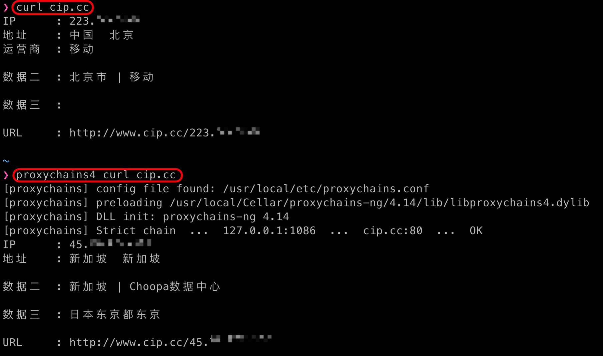
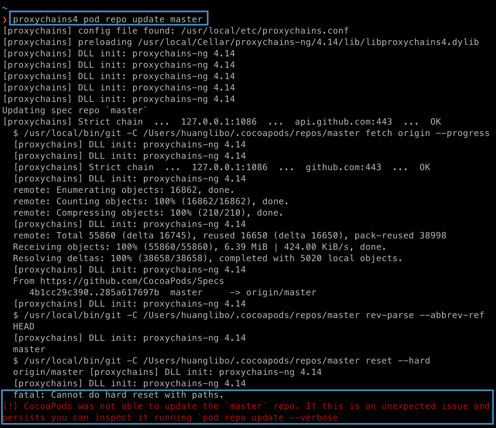
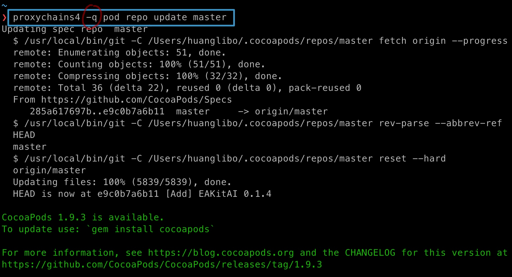

# shadowsocks 客户端的安装和配置

## iOS：Shadowrocket

**Shadowrocket**（美区，\$2.99）（**推荐**）
**Surge**（美区，可免费下载，但有内购 \$49.99）

## Android：shadowsocks-android

https://github.com/shadowsocks/shadowsocks-android/releases

## openwrt 系统的路由器：openwrt-shadowsocks

> openwrt 是 shadowsocks-libev 在 OpenWrt 上的移植
 
https://github.com/shadowsocks/openwrt-shadowsocks/releases  

## Windows：shadowsocks-windows

https://github.com/shadowsocks/shadowsocks-windows/releases

## macOS

### GUI Client：ShadowsocksX-NG（易操作）

**ShadowsocksX-NG**：https://github.com/shadowsocks/ShadowsocksX-NG/releases

### Command-line Client：shadowsocks-libev（可能更稳定）

**直接使用 shadowsocks-libev 做客户端可能更稳定**，ShadowsocksX-NG 存在停更的风险，其二次开发也会引入新的 bug。

```bash
brew install shadowsocks-libev
```

## Linux

### GUI Client：shadowsocks-qt5

[shadowsocks-qt5](https://github.com/shadowsocks/shadowsocks-qt5) （**不推荐，已停止维护**）


### Command-line Client：shadowsocks-libev

CentOS 需使用 COPR (Cool Other Package Repo) ( https://copr.fedorainfracloud.org/coprs/librehat/shadowsocks/ )  

参考：https://zzz.buzz/zh/gfw/2018/03/21/install-shadowsocks-client-on-centos-7/

```bash
# CentOS
sudo yum install -y epel-release
sudo cd /etc/yum.repos.d/
# !! For CentOS 7（ ！！其他版本需要更换资源地址）
sudo curl -O https://copr.fedorainfracloud.org/coprs/librehat/shadowsocks/repo/epel-7/librehat-shadowsocks-epel-7.repo
yum install -y shadowsocks-libev
# Ubuntu
sudo apt install shadowsocks-libev
# Manjaro
sudo pacman -S shadowsocks-libev
```

如果要从源码编译（**比较繁琐，不推荐**）。先安装依赖（ 参考：https://github.com/shadowsocks/shadowsocks-libev ）：

```
sudo yum install -y epel-release
yum install gcc gettext autoconf libtool automake make pcre-devel asciidoc xmlto c-ares-devel libev-devel libsodium-devel mbedtls-devel -y
```

安装好依赖后就可以从编译源码了。编译并安装好 shadowsocks-libev 之后，还需要自行添加 systemd 配置文件。

#### 配置 shadowsocks client 端

修改 `/etc/shadowsocks/config.json`（ 参考：https://wiki.archlinux.org/index.php/Shadowsocks ，https://wiki.archlinux.org/index.php/Shadowsocks_(简体中文) ）

```
{
    "server":"my_server_ip",
    "server_port":8388,
    "local_address": "127.0.0.1",
    "local_port":1080,
    "password":"mypassword",
    "timeout":300,
    "method":"chacha20-ietf-poly1305",
    "mode":"tcp_and_udp",
    "fast_open": false,
    "workers": 1,
    "prefer_ipv6": false
}
```

#### shadowsocks-libev client 端配置 systemd

**CentOS**：  

参考：https://zzz.buzz/zh/gfw/2018/03/21/install-shadowsocks-client-on-centos-7/#启动-shadowsocks-服务

```bash
systemctl enable --now shadowsocks-libev-local
systemctl status shadowsocks-libev-local
```

**Manjaro**：   

下面出现的 **config** 即 `/etc/shadowsocks/config.json`。（参考：https://www.shuzhiduo.com/A/MyJx3QEVzn/）

```bash
# 将本地 ss 添加到服务
sudo systemctl enable shadowsocks-libev@config
# 启动本地 ss 服务
sudo systemctl start shadowsocks-libev@config
# 查看本地 ss 服务的状态
sudo systemctl status shadowsocks-libev@config
```

### （推荐）使用 proxychains4 代理 terminal 的请求，使用 SwitchyOmega 代理浏览器的请求

> proxychains4 只可在 terminal 中使用，可自行控制是否使用代理，比较方便。如果浏览器中想使用代理，可在浏览器中添加 **SwitchyOmega** 插件。

安装：

```bash
# macOS
brew install proxychains-ng
# Manjaro
sudo pacman -S proxychains-ng
```

CentOS 需要从源码安装（参考：https://www.harker.cn/archives/proxychains.html）：

```
git clone https://github.com/rofl0r/proxychains-ng
cd proxychains-ng
sudo ./configure --prefix=/usr --sysconfdir=/etc
sudo make 
sudo make install
sudo make install-config
```

如果本地 socks5 端口是 1086，打开配置文件：  
Linux： `/etc/proxychains.conf`  
macOS： 如果使用 brew 安装的 proxychains，则是 `/usr/local/etc/proxychains.conf`  

在最后面添加：

```
socks5  127.0.0.1 1086
```

验证 proxychains 是否生效：

```bash
# 不使用代理，应输出运营商网络的 IP
curl ip.gs
# 使用代理，应输出代理服务器的 IP
proxychains curl ip.gs
```

或：`curl cip.cc` 、`proxychains4 curl cip.cc` ，输出的信息更多：




使用 proxychains4：

```
proxychains4 curl www.google.com
```

参考资料：http://einverne.github.io/post/2017/02/terminal-sock5-proxy.html

#### 在 macOS 中使用 proxychains4：应该需关闭 SIP

新系统中不需要了？下次再试试。

#### proxychains4 和 git：不支持 SSH 协议

proxychains4 是代理 http 流量的，所以：

```bash
# 通过 HTTP 协议 clone，proxychains4 支持
proxychains4 git clone https://github.com/shadowsocks/ShadowsocksX-NG.git
# 通过 SSH 协议 clone，proxychains4 不支持
proxychains4 git clone git@github.com:shadowsocks/ShadowsocksX-NG.git
```

参考资料：https://git-scm.com/book/en/v2/Git-on-the-Server-The-Protocols

#### proxychains4 和 CocoaPods：使用 -q 参数

```bash
proxychains4 pod repo update
```

报错：



proxychains4 -q pod repo update

[Stack Overflow 上的网友说](https://stackoverflow.com/questions/43152923/pod-repo-update-failed-cannot-do-hard-reset-with-paths)，是 proxychains4 的输出混入导致了 pod 执行失败，加上 -q （quiet）参数，关闭 proxychains4 的输出就可以了：

```bash
proxychains4 -q pod repo update
```




### （另一种选择）使用 privoxy 将 HTTP 请求(包括 terminal 和浏览器)转发给 socks5 代理

> 下面的设置回将全部的 HTTP 流量转发给 sock5 代理，终端和浏览器都生效，相当于全局模式。如果想避免国内流量走代理，可以添加 [genpac](https://github.com/JinnLynn/genpac)。

由于 shadowsocks 是 socks 5 代理，现在需要用 privoxy 将 HTTP 请求转发给 socks5 代理。

安装 privoxy：

```bash
# Ubuntu
sudo apt install privoxy
# Manjaro
sudo pacman -S privoxy
```

打开配置文件 `/etc/privoxy/config`，如果本地 socks5 的端口是 *1086*：

```bash
# 把 HTTP 流量转发到 1086 socks5 代理
forward-socks5 / 127.0.0.1:1086 .
```

确认 `listen-address 127.0.0.1:8118` 未被注释。  

如果想要将 http 代理非常到局域网中，可以使用 listen-address 0.0.0.0:8118，局域网中，使用 ip:8118 也能够使用该 HTTP 代理。  

可以在终端进行测试 `export http_proxy=http://127.0.0.1:8118 && curl ip.gs`，应该显示代理的 IP 地址。  

在 `sudo vim /etc/profile` 添加配置（或者在当前用户的 .zshrc 里面配置比较好？？）：

```
export http_proxy=http://127.0.0.1:8118
export https_proxy=http://127.0.0.1:8118
```

然后再 `source /etc/profile` 使配置生效。

在浏览器的设置里，添加 HTTP 代理 `127.0.0.1:8118`，浏览器就可以走代理了，此时是全局模式，国内流量也会走代理。可以添加 [genpac](https://github.com/JinnLynn/genpac) 添加 PAC 模式。  

注：privoxy 也可以用于屏蔽广告，详情请看[官方文档](http://www.privoxy.org/user-manual/actions-file.html#AF-PATTERNS)。  

参考资料：https://docs.lvrui.io/2016/12/12/Linux%E4%B8%AD%E4%BD%BF%E7%94%A8ShadowSocks-Privoxy%E4%BB%A3%E7%90%86/

## 一个非官方的实现：outline

### 简介

是 Google 母公司 Alphabet 的一个孵化项目。

宗旨：Jigsaw is an incubator within Alphabet that uses technology to address geopolitical issues.

代码仓库：https://github.com/Jigsaw-Code
主页：https://getoutline.org

### 服务端：[outline-server](https://github.com/Jigsaw-Code/outline-server)

开发工具：`Electron framework`    
平台：Window, Mac and Linux   
除了 `Outline Server`，还包含一个名为 `Outline Manager` 的管理后台。  

### 客户端：[outline-client](https://github.com/Jigsaw-Code/outline-client)

开发工具： `Cordova`, `Electron framework`   
平台：Windows, Android / ChromeOS, iOS and macOS    