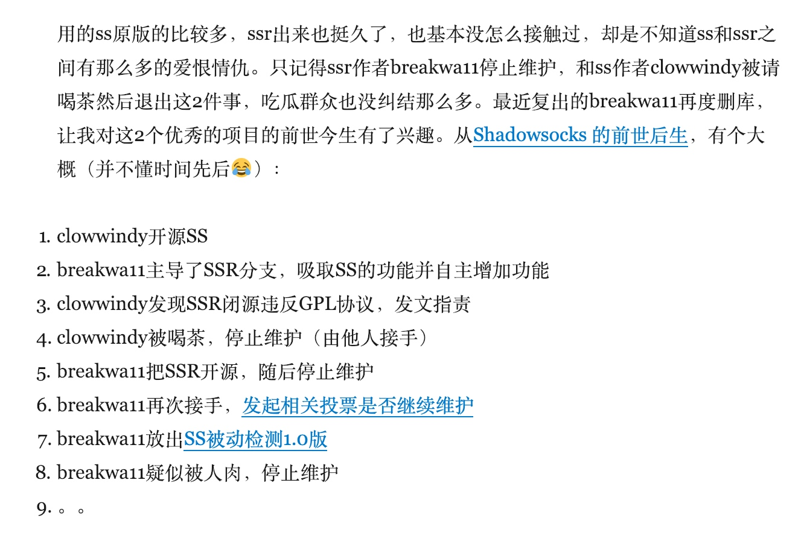

# 历史

## ss 和 ssr

ss 是 [clowwindy](https://github.com/clowwindy) 开发的原版，ssr 是被 [breakwa11](https://github.com/breakwa11) fork 出去的一个版本。一般而言 ss 用的更广泛，ssr 的功能可能多一些。目前 ss 的开发群体可能更活跃一些。    

## clowwindy 和 breakwa11

https://github.com/shadowsocks/shadowsocks-windows/issues/293#issuecomment-132253168

https://plus.google.com/+QiShengDong/posts/WNkmWcWQDxK

https://blog.wateroot.com/thinking/2017-07-27-news-about-ssr.html

