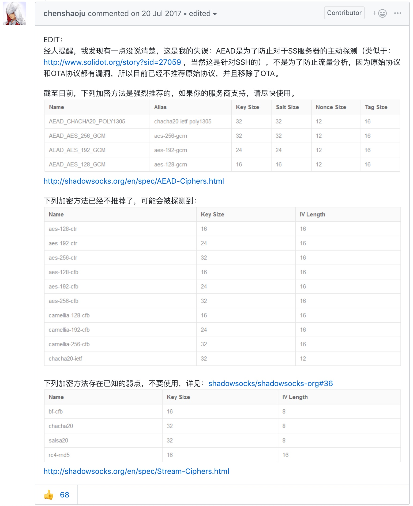

# 相关动态

## 推荐的加密方法

https://github.com/shadowsocks/shadowsocks-windows/issues/1243#issuecomment-316714974

## Surge iOS 3 因下架需要进行迁移（2018 年 11 月）

[新闻链接](https://nssurge.zendesk.com/hc/zh-cn/articles/360012200294-Surge-iOS-3-%E5%9B%A0%E4%B8%8B%E6%9E%B6%E9%9C%80%E8%A6%81%E8%BF%9B%E8%A1%8C%E8%BF%81%E7%A7%BB-2018-%E5%B9%B4-11-%E6%9C%88-)

发生了什么
我们于 2018 年 11 月 15 日收到 Apple 的通知，由于 App Store 的新条款，所有涉及 VPN 的应用需要由企业开发者账号提交，由于先前 Surge iOS 版本使用的是个人开发者账号，应用被 Apple 从 App Store 下架。

注 1：Surge 并不提供 VPN 服务也不是 VPN 工具，只是使用到了 Network Extension Framework 去实现相应的功能，但是 Apple 并未接受我们的申述。

注 2：Surge iOS 3 于 18 年 1 月就已经上架 App Store，该条款于 18 年 6 月才发布（http://www.appstorereviewguidelineshistory.com/articles/2018-06-04-wwdc2018/）。

注 3：由于 Surge iOS 使用了 iCloud 功能，所以不可进行跨开发者账号转移。

