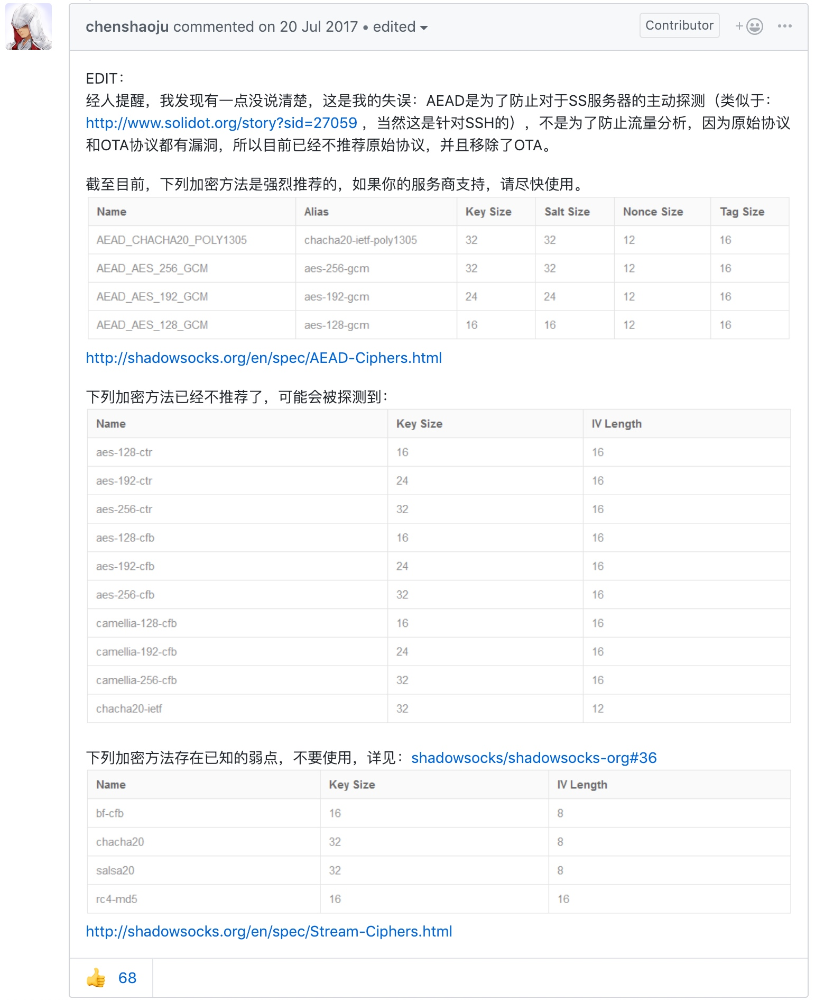
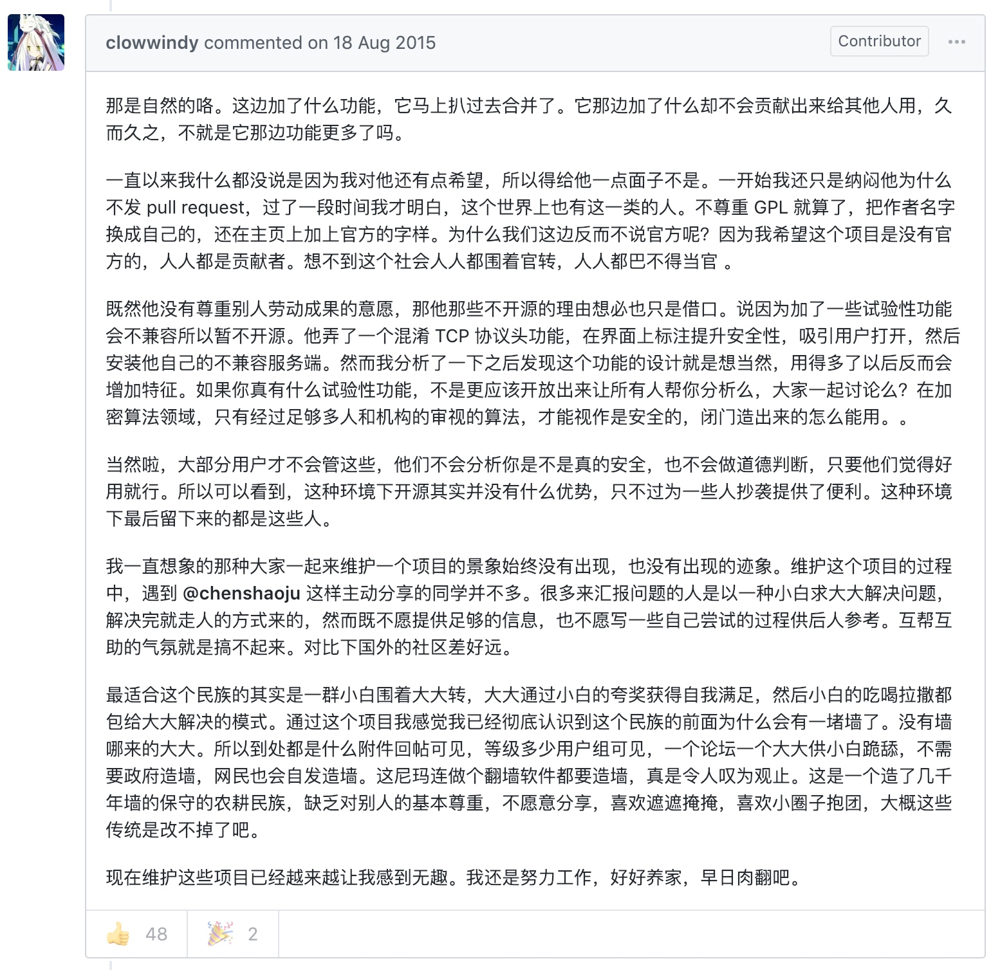
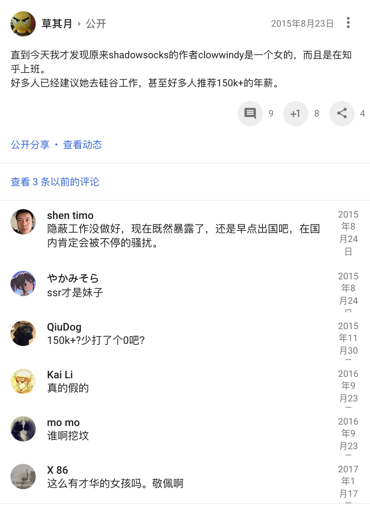
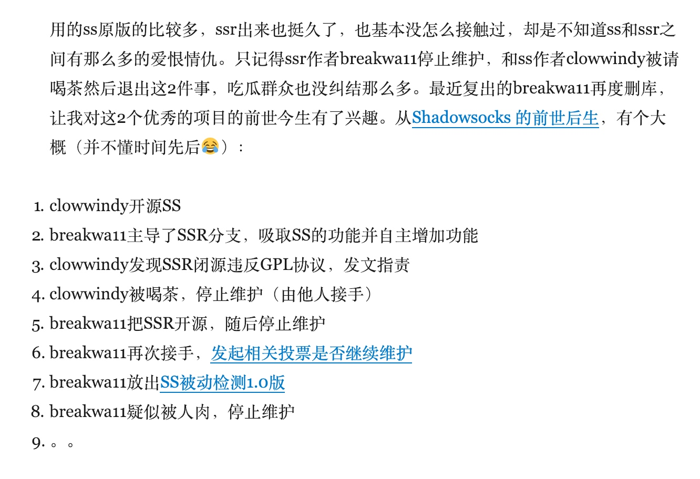

# 关于 shadowsocks 的更多资讯

## shadowsocks HOME

代码仓库：https://github.com/shadowsocks  
主页：https://shadowsocks.org  

## 服务端

> 服务端版本也包含客户端功能。

#### 不同版本的实现

https://shadowsocks.org/en/spec/Implementations.html

[shadowsocks](https://github.com/shadowsocks/shadowsocks)：最早的服务端实现，由 [clowwindy](https://github.com/clowwindy) 用 Python 开发，所以又称 `shadowsocks-python`。后来作者被相关部门邀请喝茶，被迫将仓库删除了。但是 Git 是如此强大的分布式源码管理工具，所以 fork 和 clone 遍布整个世界。  

[shadowsocks-libev](https://github.com/shadowsocks/shadowsocks-libev)：C 语言实现的版本，轻量且功能全面，**推荐**使用这个版本。  

[shadowsocks-go](https://github.com/shadowsocks/shadowsocks-go) & [go-shadowsocks2](https://github.com/shadowsocks/go-shadowsocks2)：Go 语言实现的两个版本，后者号称下一代的 Go 实现。    

[libQtShadowsocks](https://github.com/shadowsocks/libQtShadowsocks)：又称作 `shadowsocks-libqss`，可以在 Windows 上架设服务端。written in C++14 with Qt framework。   

[shadowsocks-rust](https://github.com/shadowsocks/shadowsocks-rust)：rust 的实现。

[ShadowsocksR](https://github.com/shadowsocksr-backup/shadowsocksr)：简称 ssr，[breakwa11](https://github.com/breakwa11) fork 出去的版本，当时因为不遵守 GPL 协议而被质疑。  

## 推荐的加密方法

> 使用新的加密方法时，请确认客户端是否也支持该加密方法（特别是 iOS 客户端要多留意）。  

【20200607】目前推荐 AEAD 加密方法，如：`xchacha20-ietf-poly1305`，或 `chacha20-ietf-poly1305`。

https://github.com/shadowsocks/shadowsocks-windows/issues/1243#issuecomment-316714974

## Surge iOS 3 因下架需要进行迁移（2018 年 11 月）

[新闻链接](https://nssurge.zendesk.com/hc/zh-cn/articles/360012200294-Surge-iOS-3-%E5%9B%A0%E4%B8%8B%E6%9E%B6%E9%9C%80%E8%A6%81%E8%BF%9B%E8%A1%8C%E8%BF%81%E7%A7%BB-2018-%E5%B9%B4-11-%E6%9C%88-)

发生了什么
我们于 2018 年 11 月 15 日收到 Apple 的通知，由于 App Store 的新条款，所有涉及 VPN 的应用需要由企业开发者账号提交，由于先前 Surge iOS 版本使用的是个人开发者账号，应用被 Apple 从 App Store 下架。

注 1：Surge 并不提供 VPN 服务也不是 VPN 工具，只是使用到了 Network Extension Framework 去实现相应的功能，但是 Apple 并未接受我们的申述。

注 2：Surge iOS 3 于 18 年 1 月就已经上架 App Store，该条款于 18 年 6 月才发布（http://www.appstorereviewguidelineshistory.com/articles/2018-06-04-wwdc2018/）。

注 3：由于 Surge iOS 使用了 iCloud 功能，所以不可进行跨开发者账号转移。

## 历史

### ss 和 ssr

ss 是 [clowwindy](https://github.com/clowwindy) 开发的原版，ssr 是被 [breakwa11](https://github.com/breakwa11) fork 出去的一个版本。一般而言 ss 用的更广泛，ssr 的功能可能多一些。目前 ss 的开发群体可能更活跃一些。    

### clowwindy 和 breakwa11

https://github.com/shadowsocks/shadowsocks-windows/issues/293#issuecomment-132253168

https://plus.google.com/+QiShengDong/posts/WNkmWcWQDxK

https://blog.wateroot.com/thinking/2017-07-27-news-about-ssr.html

