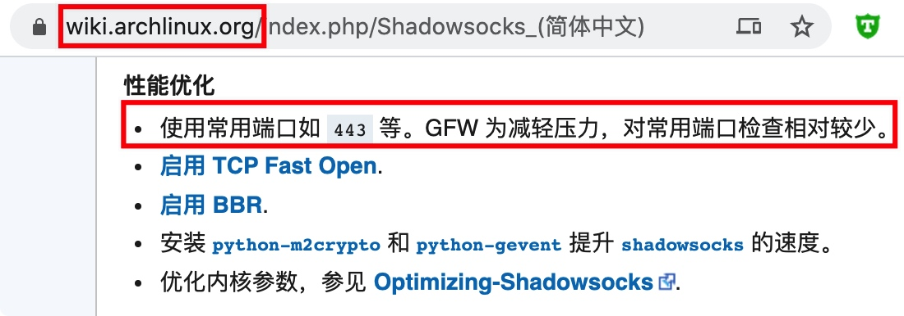

#  shadowsocks-libev 在服务端的安装、配置、运行 

shadowsocks-libev 项目的地址：https://github.com/shadowsocks/shadowsocks-libev  

## (Option 1 尝鲜) 使用 Snap 安装 shadowsocks-libev

[官方推荐](https://github.com/shadowsocks/shadowsocks-libev#quick-start)使用 [Snap](https://snapcraft.io/core) 来安装，适用于各类操作系统。（CentOS 7.6+ ，Ubuntu 16.04+）

## (Option 2) 从各系统的发行仓库安装

```bash
# Ubuntu
sudo apt update
sudo apt install -y shadowsocks-libev
```

CentOS 可以从 [COPR (Cool Other Package Repo)](https://copr.fedorainfracloud.org/coprs/librehat/shadowsocks/) 安装（ 参考：https://github.com/Huang-Libo/Internet/blob/master/shadowsocks-client.md#command-line-clientshadowsocks-libev ）。或自行从源码编译。

## (Option 3) 使用 pip 安装（不推荐）

网上提到的 pip 安装的是 [shadowsocks-python](https://github.com/shadowsocks/shadowsocks) 版本，应该是已停止维护（作者被喝%茶%🍵）了。

相关资料：  
https://pypi.org/project/shadowsocks/  
https://shadowsocks.org/en/download/servers.html  

## 配置 shadowsocks-libev server 端

打开配置文件：

```bash
sudo vim /etc/shadowsocks-libev/config.json
```

然后写入（注意要替换密码）：

```
{
    "server":"0.0.0.0",
    "mode":"tcp_and_udp",
    "server_port":443,
    "local_port":1080,
    "password":"your-password",
    "timeout":60,
    "method":"xchacha20-ietf-poly1305",
    "mode":"tcp_and_udp"
}
```

关于“为何使用 443 端口”，比较有依据原因，可以参考 [archlinux 的这篇 wiki](https://wiki.archlinux.org/index.php/Shadowsocks_(简体中文))：



## 管理 shadowsocks-libev server 端

```bash
# 添加到服务
systemctl enable shadowsocks-libev
# 启动服务
systemctl start shadowsocks-libev
# 查看服务状态
systemctl status shadowsocks-libev
# 重启服务
systemctl restart shadowsocks-libev
```

## 【可选项】服务端管理后台

[Shadowsocks-Manager](https://github.com/shadowsocks/shadowsocks-manager) 是一个基于Node.js开发的 shadowsocks 多用户管理平台，支持 libev 和 python 版