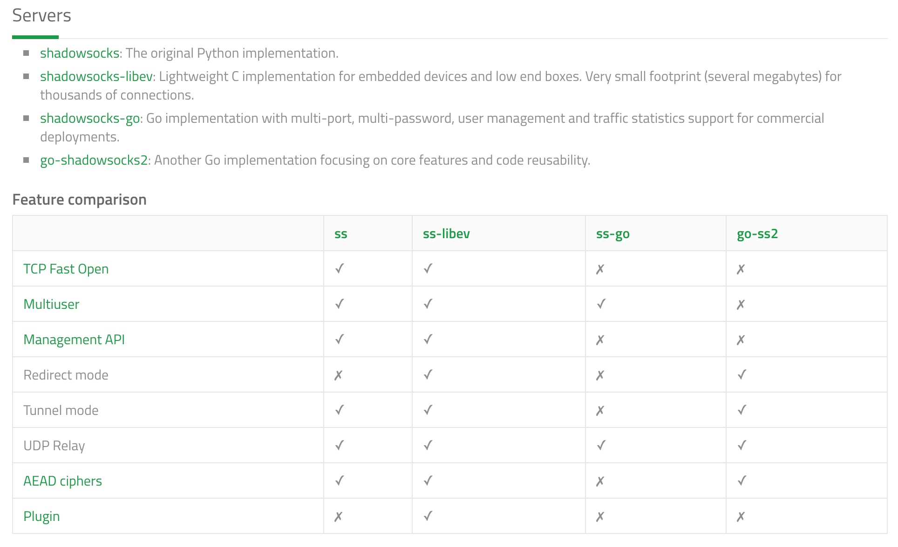
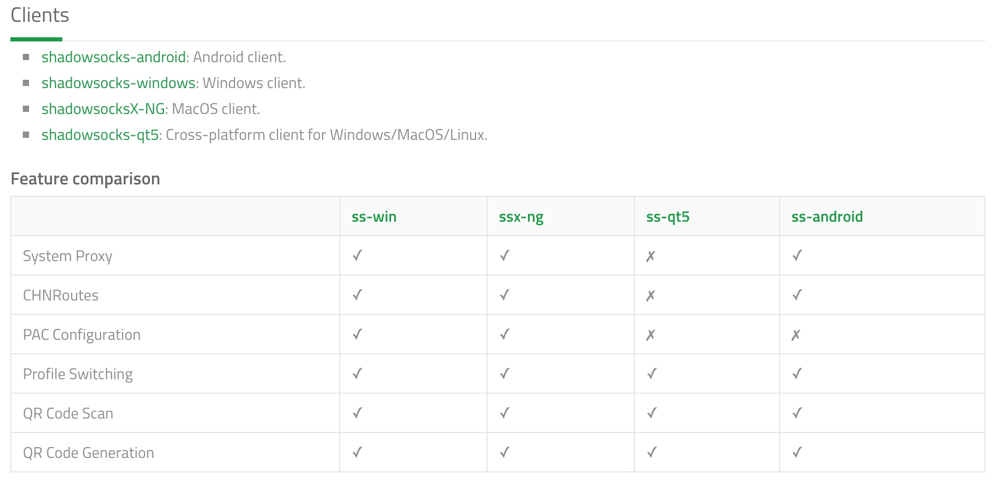

# shadowsocks

> socks5 代理。

## shadowsocks HOME

代码仓库：https://github.com/shadowsocks  
主页：https://shadowsocks.org  
支持的平台：`Windows`, `Linux`, `Mac`, `Android`(client only), `iOS`(client only), `OpenWRT`(client only).   

## 服务端

> 服务端版本也包含客户端功能。

#### 不同版本的实现

https://shadowsocks.org/en/spec/Implementations.html




[shadowsocks](https://github.com/shadowsocks/shadowsocks)：最早的服务端实现，由 [clowwindy](https://github.com/clowwindy) 用 Python 开发，所以又称 `shadowsocks-python`。后来作者被相关部门邀请喝茶，被迫将仓库删除了。但是 Git 是如此强大的分布式源码管理工具，所以 fork 和 clone 遍布整个世界。  

[shadowsocks-libev](https://github.com/shadowsocks/shadowsocks-libev)：C 语言实现的版本，轻量且功能全面，笔者**推荐**使用这个版本。  

[shadowsocks-go](https://github.com/shadowsocks/shadowsocks-go) & [go-shadowsocks2](https://github.com/shadowsocks/go-shadowsocks2)：Go 语言实现的两个版本，后者号称下一代的 Go 实现。    

[libQtShadowsocks](https://github.com/shadowsocks/libQtShadowsocks)：又称作 `shadowsocks-libqss`，可以在 Windows 上架设服务端。written in C++14 with Qt framework。   

[shadowsocks-rust](https://github.com/shadowsocks/shadowsocks-rust)：rust 的实现。

[ShadowsocksR](https://github.com/shadowsocksr-backup/shadowsocksr)：简称 ssr，[breakwa11](https://github.com/breakwa11) fork 出去的版本，当时因为不遵守 GPL 协议而被质疑。  

#### 在服务端安装 shadowsocks-libev

> 使用包管理器，或者 `pip3`。

###### CentOS

传统的包管理工具是 `yum`，但是现在有被新晋包管理工具 `dnf` 取代的趋势。  

###### Ubuntu

使用包管理工具 `apt`。

#### 服务端的配置

> 官方配置文件说明：https://shadowsocks.org/en/config/quick-guide.html

开机自启动：  

```bash
sudo systemctl start shadowsocks-libev.service
```

## 客户端

https://shadowsocks.org/en/spec/Implementations.html




#### 桌面端

###### macOS
1. GUI Client：[ShadowsocksX-NG](https://github.com/shadowsocks/ShadowsocksX-NG/releases)   
2. Command-line Client：

```bash
brew install shadowsocks-libev
```

###### Windows
1. GUI Client：[shadowsocks-windows](https://github.com/shadowsocks/shadowsocks-windows/releases)
2. Command-line Client：

```bash
# 需要在 Windows 上先安装 Python3 以及 pip3 
pip3 install shadowsocks
```

###### Linux
1. GUI Client：[shadowsocks-qt5](https://github.com/shadowsocks/shadowsocks-qt5) （ Cross-platform client for Windows/MacOS/Linux.）
2. Command-line Client：

```bash
sudo apt install shadowsocks-libev
```

补充说明：  
桌面端都可以使用 `pip3` 来安装：  

```bash
pip3 install shadowsocks
```

Linux 和 macOS 也可以使用 perl 的 cpan 来安装：  

```bash
cpan Net::Shadowsocks
```

#### 移动端

###### iOS

SuperRocket（中区，￥6），SsrConnectPro（美区，免费），shadowrocket（美区，\$2.99），Surge 3（美区，可免费下载，但有内购 \$49.99）

越狱设备可以使用 `Big Boss` ？

###### Android

[shadowsocks-android](https://github.com/shadowsocks/shadowsocks-android/releases)

#### 其他嵌入式设备

###### openwrt 系统的路由器

[openwrt-shadowsocks](https://github.com/shadowsocks/openwrt-shadowsocks)： shadowsocks-libev 在 OpenWrt 上的移植。 


## 服务端管理后台

[Shadowsocks-Manager](https://github.com/shadowsocks/shadowsocks-manager) 是一个基于Node.js开发的 shadowsocks 多用户管理平台，支持 libev 和 python 版

## 插件

> 插件说明：https://shadowsocks.org/en/spec/Plugin.html

#### kcptun

[kcptun](https://github.com/xtaci/kcptun)：A Stable & Secure Tunnel Based On KCP with N:M Multiplexing

[kcptun-android](https://github.com/shadowsocks/kcptun-android)

#### simple-obfs

[simple-obfs-android](https://github.com/shadowsocks/simple-obfs-android)：simple-obfs plugin for shadowsocks-android.

## 一个非官方的实现：outline

#### 简介

是 Google 母公司 Alphabet 的一个孵化项目。

宗旨：Jigsaw is an incubator within Alphabet that uses technology to address geopolitical issues.

代码仓库：https://github.com/Jigsaw-Code
主页：https://getoutline.org

#### 服务端：[outline-server](https://github.com/Jigsaw-Code/outline-server)

开发工具：`Electron framework`    
平台：Window, Mac and Linux   
除了 `Outline Server`，还包含一个名为 `Outline Manager` 的管理后台。  

#### 客户端：[outline-client](https://github.com/Jigsaw-Code/outline-client)

开发工具： `Cordova`, `Electron framework`   
平台：Windows, Android / ChromeOS, iOS and macOS    


## FAQ

#### 服务端已部署好ss，状态检查正常，为何客户端连不上？

请查看是否被服务端的防火墙阻止连接了。

`CentOS 7`：  

```bash
# 关闭防火墙
sudo service iptables stop
# 禁止防火墙开机启动
sudo systemctl stop iptables.service
```

如果熟悉防火墙配置也可以自行配置。  

**另外，有些云服务商的后台还有一套端口开关，需要用户去网站其后台打开需要使用的端口，比如青云。**

## 参考链接

[一键安装脚本](https://github.com/teddysun/shadowsocks_install) ：由 [teddysun](https://github.com/teddysun) 发布于 GitHub。


