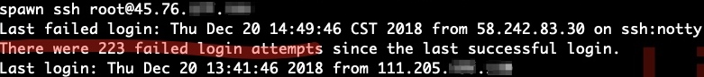
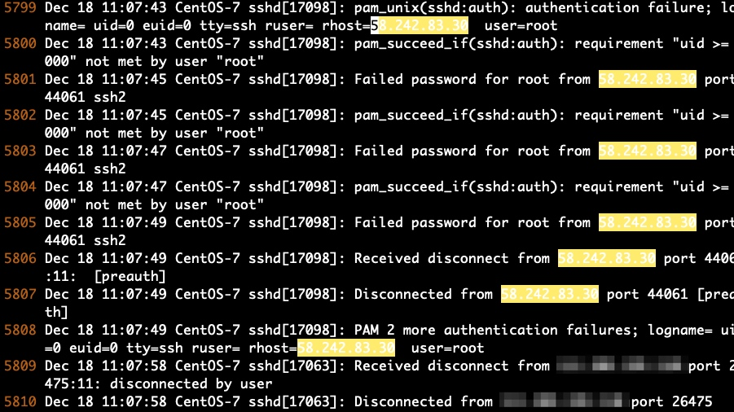
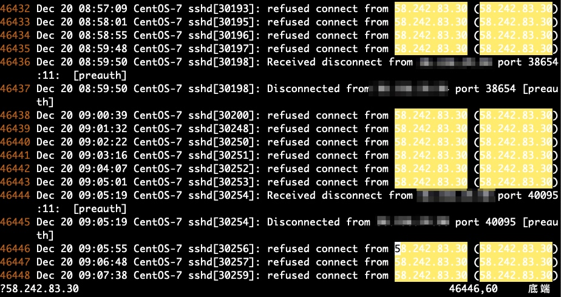
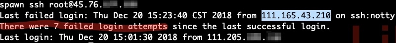
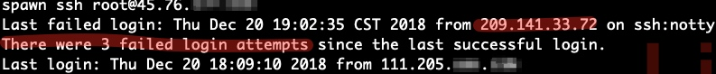
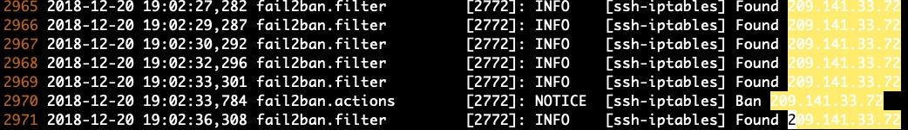
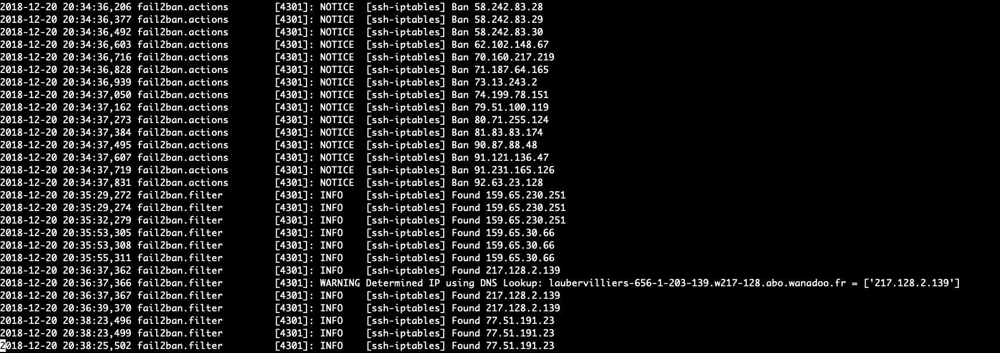

# SSH 服务的隐患

## 发现隐患：有人在尝试暴力破解我们服务器的 root 密码

最近登录服务器，终端总提示在上次成功登录之后，有几百次登录失败的记录。即使有的时候只是短暂退出登录后再登录，也会看到有好几次登录失败的尝试。  

可以看出，我们的服务器被恶意脚本缠上了。  



查询其 IP，显示为安徽某地：  


查看 `/var/log/secure` 日志：  





可以看到这个恶意行为已经持续了两天多，真是孜孜不倦，也从侧面反映我们的 root 密码还是相当安全的。  

## 基本防御：禁掉这个 IP

比较直观的想法是禁止此 IP 通过 SSH 登录我们的服务器。配置方法也很简单，打开 `/etc/hosts.deny`，添加如下配置：  

```bash
sshd:58.242.83.*
```

也可以在 `/etc/hosts.allow` 中通过 `deny` 关键字来禁止某些 IP：  

```bash
sshd:58.242.83.*:deny
```

退出登录后过一段时间再登录，没有登录失败的记录了。

## 故事没有结束：它换 IP 了

又过了几十分钟后，再次登录服务器时，又看到了多次登录失败的记录，恶意脚本在另一个地方执行了。看来之前的方法局限性很大。  



## 分析问题产生的原因

SSH 的默认端口号是 22，Linux 的超级管理员的用户名是 root，恶意脚本只需要扫描到一个服务器是活跃的，就可以使用 `ssh root@ip` 命令 + *密码字典*来尝试暴力破解 root 密码。

## 比较各类防御措施

网上常见的防御措施中，比较有可行性的有这些：  

#### 只允许部分 IP 远程登录

在 `/etc/hosts.allow` 添加允许的 IP，在 `/etc/hosts.deny` 中禁掉所有 IP（具体配置方法请自行搜索）。这种设定比较适合企业。  

#### 改变 SSH 的默认端口

改变默认端口号之后，就需要使用 `-p` 参数来显示指定 SSH 的端口号。

缺点：我们自己登录的时候也比较麻烦，另外，端口号也是可以扫描的（但大部分恶意脚本应该不会这么做，试错成本太高了）。

#### 禁止 root 用户远程登录

> 先通过普通用户登录，然后再切换到 root。

在执行下述操作前，先确保有其他可以登录服务器的用户。  

在 `/etc/ssh/sshd_config` 配置文件中找到 `PermitRootLogin` 选项，将后面的 yes 改为 no ，取消注释，这样root就不能远程登录了。  

然后重启 SSH 服务：  

```bash
systemctl restart sshd.service
```

缺点：每次都得先登录另一个用户，太麻烦了。（虽然有人说不要直接使用 root 用户，但是我觉得个人的小服务器还是以操作效率为第一要义。）

#### 写脚本

通过定时读取 `/var/log/secure` 日志，将失败次数较多的 IP 添加到 `/etc/hosts.deny` 文件中。  

缺点：有现成的脚本吗（以及这个现成的脚本靠谱吗）？有现成的管理工具吗？  

#### fail2ban

正当我辛苦找寻时，bingbig 发来一个链接说：这玩意儿好：    

https://www.ryadel.com/en/centos-ssh-unwanted-failed-login-attempts-fail2ban/  

仔细看了一下，然后又找到其 [github 仓库](https://github.com/fail2ban/fail2ban)，发现此项目还在活跃开发中，大喜、准备使用。然后无意间发现 `/var/log/` 下有一个 `fail2ban.log` 日志，难道 `CentOS7` 已经自带 fail2ban？查看 `fail2ban` 状态：     

```bash
systemctl status fail2ban
```

显示服务未开启，看来系统已经自带了此工具。大喜、打开服务：

```bash
# 设置开机自启动
systemctl enable fail2ban
# 启动 fail2ban
systemctl start fail2ban
```

配置文件 `/etc/fail2ban/jail.conf` 中的常用配置（下面数字的单位是秒）：  

```bash
# "bantime" is the number of seconds that a host is banned.
bantime  = 3600

# A host is banned if it has generated "maxretry" during the last "findtime"
# seconds.
findtime  = 600

# "maxretry" is the number of failures before a host get banned.
maxretry = 5
```

上述配置解读：如果一个 IP 在 10 分钟内密码输错超过 5 次，就禁掉这个 IP 1 小时。  

修改配置后需要重启服务：  

```bash
systemctl restart fail2ban
```

方案优点：很智能、很便捷，不需要改动默认设置，对服务器的使用者来说是无感知的，以前怎么登录，现在继续那样登录。  

## Problem Solved！

这些恶意脚本应该也有试错判断（成本控制），如果长时间被拒绝登录，恶意脚本应该就会将此服务器标识为“难以搞定的”，然后放弃恶意登录我们的服务器。 

## 后续

过了俩小时，再次登录，看到了少量新 IP 登录失败尝试：  




查看 `/var/log/fail2ban.log` 日志，失败五次被 Ban 了：     



然后一个小时后 `fail2ban` 主动解禁了此 IP：  


然后我和 bingbig 合计了一下，这帮坏淫，不禁五百年何以解忧！修改配置：

```
bantime  = 15768000000
```

然后重启服务：  

```bash
systemctl restart fail2ban.service
```

再看 `/var/log/fail2ban.log` 日志：  



之前被 Ban 过的 IP 全部被禁 500 年了（总数多达近百个 IP，而我们的服务器才刚用十天的样子……）。  

然后截图往下看，又来了几个尝试登录的 IP，唔，外网真是一个野蛮的丛林。

## 结局

`fail2ban` 其实已经很好用了，基本上杜绝了服务器被暴力破解的可能，但是我是一个强迫症用户，每次登录看到 x 次登录失败的提示，心里就很乱，就想去看 `fail2ban` 的日志。  

我先是尝试禁止 root 通过 SSH 登录，但是发现服务器虽然不会让 root 登录入系统，但是还是会给用户输入密码的机会，失败记录还是会记入 fail2ban 的日志。  

最后，我改了 SSH 的端口，打开配置文件 `/etc/ssh/sshd_config`，添加下面这行（可以添加多个端口）：  

```bash
Port 2022
```
 
然后重启 SSH 服务：  

```bash
systemctl restart sshd.service
```

设置好之后，依然以 root 用户登录，但是需要显示指定端口号：  

```bash
ssh -p 2022 root@ip
```

世界终于安静了！！！


